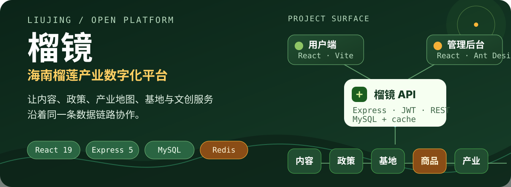

<p align="center">
  
</p>

<h1 align="center">榴镜</h1>

<p align="center">
  <strong>海南榴莲产业数字化平台</strong><br />
  <sub>内容 · 政策 · 产业地图 · 基地 · 文创服务</sub>
</p>

<p align="center">
  <a href="https://github.com/Freakz2z/LiuJing"></a>
  <a href="https://react.dev/"></a>
  <a href="https://vite.dev/"></a>
  <a href="https://expressjs.com/"></a>
  <a href="./LICENSE"></a>
</p>

<p align="center">
  
</p>

> 榴镜是一个围绕海南榴莲产业搭建的全栈 Web 应用：用户可以浏览内容、政策、产业地区、合作基地与文创商品，登录后还能使用收藏、预约、购物车和订单功能；管理端则负责维护这些内容与运营数据。

[快速开始](#快速开始) · [功能地图](#功能地图) · [项目结构](#项目结构) · [API 一览](#api-一览) · [开发说明](#开发说明)

## 功能地图

| 层级 | 已实现的主要能力 |
| --- | --- |
| 用户端 `client/` | 首页轮播、内容库与详情、政策阅读、海南产业地图、基地浏览、商品浏览；注册登录、收藏、预约、购物车、订单与反馈 |
| 管理后台 `admin/` | 数据概览，以及轮播图、内容、用户、基地、商品、预约、订单、政策、产业地区、产业项目和媒体库管理 |
| 服务端 `server/` | Express REST API、JWT 登录校验、MySQL 数据访问、公开数据 Redis 缓存、图片压缩/多尺寸处理、视频缩略图与文件上传 |

### 数据链路

```text
React 用户端 ─────────────┐
                          ├──> Express API ───> MySQL
React + Ant Design 管理端 ┘          │
                                    ├──> Redis（公开接口缓存，可选）
                                    └──> server/uploads（本地媒体目录）
```

## 快速开始

### 环境要求

- Node.js `20.19+` 或 `22.12+`
- MySQL：用于用户、内容、政策、商品、预约与订单数据
- Redis：可选，用于缓存公开接口

### 1. 获取代码并配置服务端

```bash
git clone https://github.com/Freakz2z/LiuJing.git
cd LiuJing
cp server/.env.example server/.env
```

编辑 `server/.env`，至少填写数据库连接信息和随机的 `JWT_SECRET`。`.env` 已被 Git 忽略，请不要把真实凭据提交到仓库。

### 2. 初始化数据库

```bash
mysql -u root -p < server/schema.sql
```

`schema.sql` 含有基础表结构与演示数据。管理员记录是占位数据，首次部署时请自行设置管理员密码；仓库不提供可用于真实环境的默认密码。

> 当前 `schema.sql` 主要覆盖基础内容、用户、商品与预约表；订单、购物车、产业地图和媒体库模块还依赖部署环境中的对应表结构。使用这些模块前，请先将数据库 schema 与当前代码同步。

### 3. 启动三端

macOS / Linux：

```bash
./start.sh
```

Windows：

```bat
start.bat
```

启动脚本会按需安装 `server`、`client` 和 `admin` 的依赖，并启动三个服务。停止服务：

```bash
# macOS / Linux
./stop.sh

# Windows
stop.bat
```

访问地址：

| 服务 | 地址 |
| --- | --- |
| 用户端 | <http://localhost:5173> |
| 管理后台 | <http://localhost:5174> |
| API | <http://localhost:3000> |

### 分别启动

需要单独调试某一端时，先在仓库根目录安装依赖：

```bash
npm --prefix server install
npm --prefix client install
npm --prefix admin install
```

然后分别在三个终端启动：

```bash
(cd server && npm start)
(cd client && npm run dev)
(cd admin && npm run dev)
```

## API 一览

基础地址：`http://localhost:3000/api`

### 公开接口

```text
GET  /public/home
GET  /public/contents
GET  /public/contents/:id
GET  /public/policies
GET  /public/policies/:id
GET  /public/products
GET  /public/bases
GET  /public/regions
GET  /public/industry
GET  /public/industry/:regionId
```

### 用户接口（需要登录）

```text
POST   /user/login
POST   /user/register
GET    /user/profile
GET    /user/favorites
GET    /user/appointments
POST   /user/appointments
POST   /user/feedback
GET    /user/cart
POST   /user/cart
GET    /user/orders
POST   /user/orders
PUT    /user/orders/:id/pay       # 当前为模拟支付
PUT    /user/orders/:id/cancel
```

### 管理接口（需要管理员权限）

管理端覆盖以下资源的查询、创建、编辑或删除：`banners`、`contents`、`users`、`bases`、`products`、`appointments`、`orders`、`policies`、`regions`、`industry_items` 与 `media`。

## 项目结构

```text
LiuJing/
├── client/                 # React + Vite 用户端
│   ├── public/             # Logo、图标与海南地图 GeoJSON
│   └── src/pages/          # 内容、政策、商品、基地、产业等页面
├── admin/                  # React + Ant Design 管理后台
│   ├── public/             # 后台静态资源
│   └── src/pages/          # 数据概览与资源管理页面
├── server/                 # Node.js + Express API
│   ├── controllers/        # 业务控制器
│   ├── routes/             # public / user / admin / upload 路由
│   ├── middleware/         # 登录鉴权与上传处理
│   ├── scripts/            # 图片、视频与媒体维护脚本
│   ├── schema.sql          # MySQL 基础结构与演示数据
│   └── .env.example        # 服务端配置模板
├── assets/readme/          # README 视觉资产
├── start.sh / start.bat    # 启动脚本
└── stop.sh / stop.bat      # 停止脚本
```

## 开发说明

- `client` 和 `admin` 的 Vite 开发服务器分别监听 `5173` 与 `5174`，并把 `/api`、`/uploads` 代理到 `3000`。
- 上传媒体默认写入 `server/uploads/`；图片会经过 Sharp 处理，上传目录不会进入 Git。
- 公开接口使用 Redis 做 5 分钟缓存；没有本地 Redis 时，服务端会回退到数据库读取，但建议联调时观察服务端日志。
- 订单支付接口目前只更新订单状态，不接入真实支付渠道。
- 数据库与媒体内容属于部署环境状态，仓库只提供代码、基础 schema 与少量演示数据。

## License

[MIT](./LICENSE) © 2026 Freakz2z
